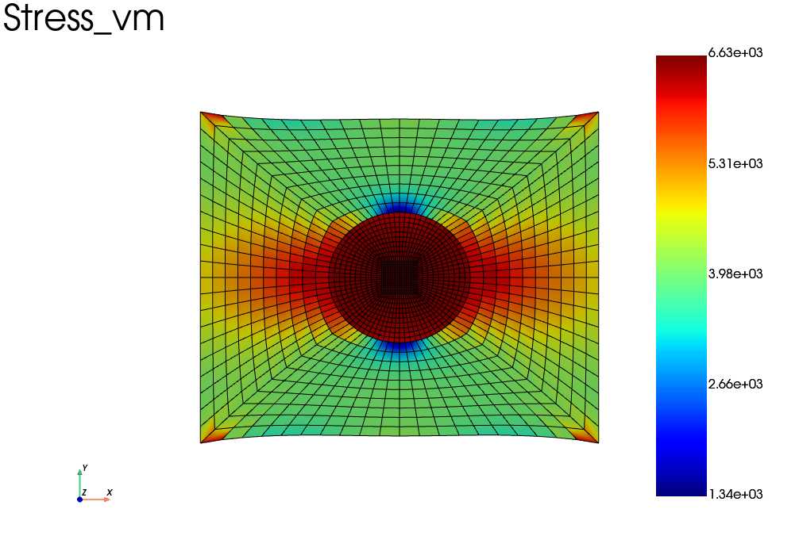

==================================
Heterogeneous structures
==================================

.. currentmodule:: fedoo

It is frequent that one needs to define a structure composed of
several materials. 
The first step to define a heterogeneous material in fedoo is to 
get a mesh and the set of elements associated to each material. 

Such a mesh could be generated for instance with microgen from the set 3mah
or using the gmsh library. 

As sake of example, lets build a simple heterogeneous mesh with fedoo functions:
a 2D square with a round inclusion.

.. code-block:: python

    import fedoo as fd
    import numpy as np
    
    #Generate a mesh with a spherical inclusion inside
    
    #matrix 
    mesh = fd.mesh.hole_plate_mesh(nr=11, nt=11, length=100, height=100, radius=20, \
    	elm_type = 'quad4', name ="Domain")
    mesh.element_sets['matrix'] = np.arange(0,mesh.n_elements)
    
    #inclusion
    mesh_disk = fd.mesh.disk_mesh(20, 11, 11)
    mesh_disk.element_sets['inclusion'] = np.arange(0,mesh_disk.n_elements)
            
    #glue the inclusion to the matrix
    mesh = mesh + mesh_disk
    mesh.merge_nodes(np.c_[mesh.node_sets['hole_edge'], mesh.node_sets['boundary']])
    
Now we would like to assign different constitutive laws for the matrix and for the inclusion.

There are 3 methods to do this in fedoo.

1st method: 
==============================

Most of constitutive laws accept to be given arrays of material properties 
instead of scalar values. The arrays of properties are interpreted depending on 
their dimensions as:
    - gauss points values
    - element values
    - node values

Of course the array shapes have to be consistend with the mesh dimensions when
creating the Assembly. 

.. code-block:: python    

    fd.ModelingSpace("2Dstress")
    
    #Define an array of young modulus for each element
    E = np.empty(mesh.n_elements)
    E[mesh.element_sets['matrix']] = 2e4
    E[mesh.element_sets['inclusion']] = 1e5
    
    material = fd.constitutivelaw.ElasticIsotrop(E, 0.3) 
    wf = fd.weakform.StressEquilibrium(material) 
    assembly = fd.Assembly.create(wf, mesh) 

This method is propably the simpliest, but is restricted to cases where the 
material behavior is the same for all phases. 

2nd method: 
==============================

The classic way of defining heterogeneous constitutive laws is to 
define several distinct assemblies and to build an AssemblySum object containing the 
addition of the two assemblies. 
For that purpose, the mesh need to be splited into sub-meshes containing only 
the elements associated to one phase, but that point to the same nodes list. 
The Mesh class propose a method dedicated to this operation: 
:py:meth:`fedoo.Mesh.extract_elements`.

Then we need to define one constitutivelaw, one weakform and one assembly for
each phase before defining the global assembly with a simple addition of the 
assemblies (see :py:meth:`fedoo.Assembly.sum` for more details).

.. code-block:: python    

    fd.ModelingSpace("2Dstress")

    material1 = fd.constitutivelaw.ElasticIsotrop(2e4, 0.3) 
    material2 = fd.constitutivelaw.ElasticIsotrop(1e5, 0.3) 
    
    #Create the weak formulation of the mechanical equilibrium equation
    wf1 = fd.weakform.StressEquilibrium(material1) 
    wf2 = fd.weakform.StressEquilibrium(material2) 
    
    #Create a global assembly
    assemb1 = fd.Assembly.create(wf1, mesh.extract_elements('matrix')) 
    assemb2 = fd.Assembly.create(wf2, mesh.extract_elements('inclusion')) 
    
    assembly = assemb1 + assemb2
    

3rd method: 
==============================

To allow for a more compact writting, and avoiding the sum of assemblies, fedoo propose 
a built-in constitutive law dedicated to heterogeneous material:
:py:class:`fedoo.constitutivelaw.heterogeneous.Heterogeneous`

This class allows to define one material as the combination of several materials 
associated to sets of elements. The code is shorter and more easy to read. 

This methods seems to be very slightly less efficient than method 2 (to be confirmed), but the 
difference is barely visisble though and shouldn't be a real matter for everyone. 

.. code-block:: python    

    fd.ModelingSpace("2Dstress")

    material1 = fd.constitutivelaw.ElasticIsotrop(2e4, 0.3) 
    material2 = fd.constitutivelaw.ElasticIsotrop(1e5, 0.3) 
 
    material = fd.constitutivelaw.Heterogeneous((material1, material2), ('matrix', 'inclusion'))
 
    wf = fd.weakform.StressEquilibrium(material) 
    assembly = fd.Assembly.create(wf, mesh) 
    
    

Full example: 
==============================
Here is the full script with the 3rd method and the visualization:

.. code-block:: python
    
    import fedoo as fd
    import numpy as np
    
    #Generate a mesh with a spherical inclusion inside
    
    #matrix 
    mesh = fd.mesh.hole_plate_mesh(nr=11, nt=11, length=100, height=100, radius=20, \
    	elm_type = 'quad4', name ="Domain")
    mesh.element_sets['matrix'] = np.arange(0,mesh.n_elements)
    
    #inclusion
    mesh_disk = fd.mesh.disk_mesh(20, 11, 11)
    mesh_disk.element_sets['inclusion'] = np.arange(0,mesh_disk.n_elements)
            
    #glue the inclusion to the matrix
    mesh = mesh + mesh_disk
    mesh.merge_nodes(np.c_[mesh.node_sets['hole_edge'], mesh.node_sets['boundary']])
    
    #Define the Modeling Space - Here 2D problem with plane stress assumption.
    fd.ModelingSpace("2Dstress") 
    
    #define the materials and build the heterogeneous Assembly
    material1 = fd.constitutivelaw.ElasticIsotrop(2e4, 0.3) 
    material2 = fd.constitutivelaw.ElasticIsotrop(1e5, 0.3) 
    
    material = fd.constitutivelaw.Heterogeneous((material1, material2), ('matrix', 'inclusion'))
    
    wf = fd.weakform.StressEquilibrium(material) 
    assembly = fd.Assembly.create(wf, mesh)      
    
    #Define a new static problem
    pb = fd.problem.Linear(assembly)
    
    #Definition of the set of nodes for boundary conditions
    left = mesh.find_nodes('X',mesh.bounding_box.xmin)
    right = mesh.find_nodes('X',mesh.bounding_box.xmax)
    
    #Boundary conditions
    pb.bc.add('Dirichlet', left, 'Disp',    0 )     
    pb.bc.add('Dirichlet', right, 'Disp', [20,0] )     
    pb.apply_boundary_conditions()
    
    #Solve problem
    pb.solve()
    
    #---------- Post-Treatment ----------    
    res = pb.get_results(assembly, ['Stress','Strain', 'Disp'])
    res.plot('Stress', component='vm')
    

