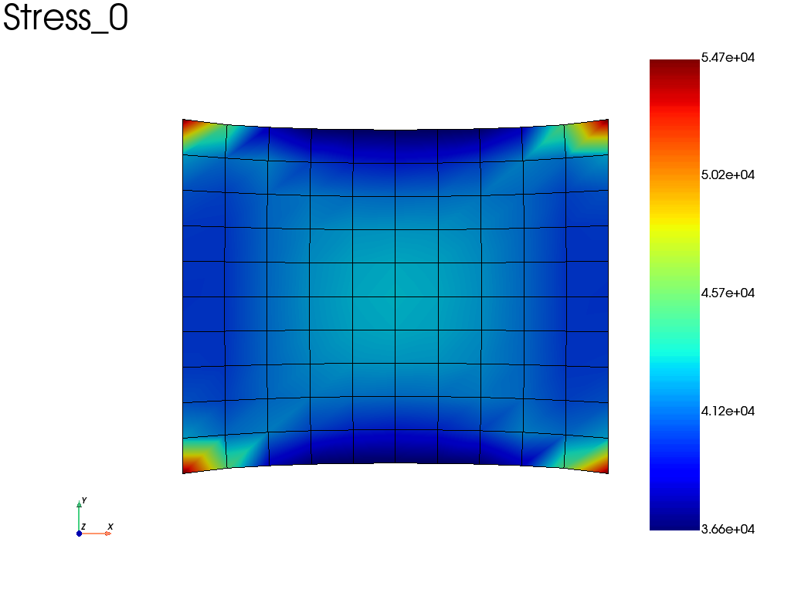
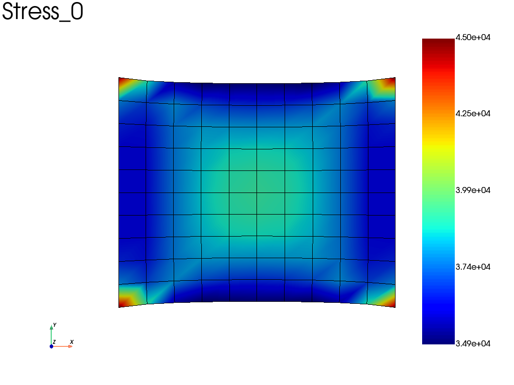
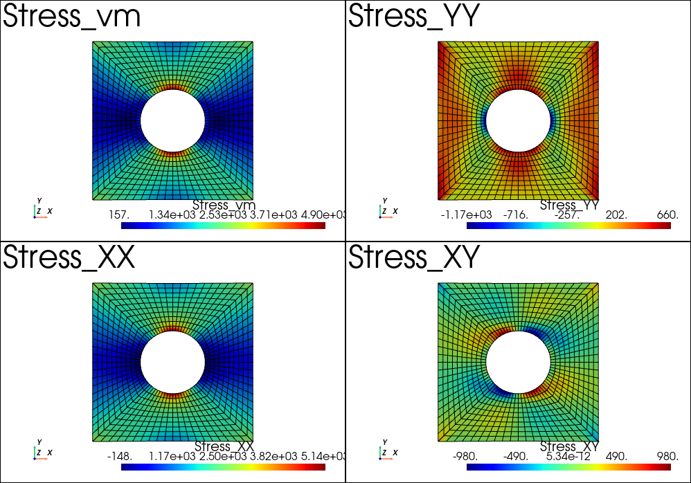

=================================
Post-Treatment
=================================

.. currentmodule:: fedoo

Get results from a problem
==============================

In fedoo, most of the standard results are easily exportable using the 
:py:meth:`fedoo.Problem.get_results` method of the problem class.

The get_results method returns a :py:class:`fedoo.DataSet` object which come with 
several methods for plotting, saving and loading mesh dependent results.

To avoid a redundent call of the get_results function, especially for time 
dependent problems, one can simply add some required output with the 
:py:meth:`fedoo.Problem.add_output` method. This create a :py:class:`MultiFrameDataSet` object 
associated to the problem. Once the required outputs are defined for a problem, the 
:py:meth:`fedoo.Problem.save_results` method allow to save the results at a given iteration
into the :py:class:`MultiFrameDataSet`. In particular, for non linear problems
solved using :py:meth:`Problem.nlsolve`, results are
automatically saved at certain iteration dependending on the choosen parameters.

Class DataSet
--------------------

.. autosummary::   
   :toctree: generated/
   :template: custom-class-template.rst

   DataSet

Class MultiFrameDataSet
---------------------------

.. autosummary::   
   :toctree: generated/
   :template: custom-class-template.rst

   MultiFrameDataSet

Example
--------------

For example, defining and solving a very simple problem :

.. code-block:: python

    import fedoo as fd

    fd.ModelingSpace("2Dstress")    
    mesh = fd.mesh.rectangle_mesh()
    material = fd.constitutivelaw.ElasticIsotrop(2e5, 0.3)
    wf = fd.weakform.StressEquilibrium(material)
    assembly = fd.Assembly.create(wf, mesh)
    
    #Define a new static problem
    pb = fd.problem.Linear(assembly)
    
    #Boundary conditions
    pb.bc.add('Dirichlet', 'left', 'Disp',    0 )
    pb.bc.add('Dirichlet', 'right', 'Disp',  [0.2,0] )
    
    pb.apply_boundary_conditions()
    
    #Solve problem
    pb.solve()
    

Then, we can catch the Stress, Displacement and Strain fields using: 

.. code-block:: python

    results = pb.get_results(assembly, ["Stress", "Disp", "Strain"])
    results.plot("Stress", "Node", component='XX') #plot the sigma_xx averaged at nodes
    

Alternatively, if we take the same problem, but accounting for geometric 
non linearities (nlgeom = True), we can automatically save results at specified time interval 
(here the results are saved on a file).

.. code-block:: python

    wf.nlgeom = True
    pb_nl = fd.problem.NonLinear(assembly)
    
    #Boundary conditions
    pb_nl.bc = pb.bc
    
    results_nl = pb_nl.add_output('nl_results', assembly, ["Stress", "Disp", "Strain"])

    pb_nl.nlsolve(dt = 0.1, tmax = 1, interval_output = 0.2)
    
    #plot the sigma_xx averaged at nodes at the last increment
    results_nl.plot("Stress", "Node", component='XX') 

    
Basic operations
====================

Plotting results
-------------------

A few convinient methods are proposed to generate image of movie from :py:class:`DataSet` 
and :py:class:`MultiFrameDataSet` objects. 

.. autosummary::
   :toctree: generated/
   
   DataSet.plot
   MultiFrameDataSet.plot
   MultiFrameDataSet.plot_history
   MultiFrameDataSet.write_movie

Save results
-------------------

.. autosummary::
   :toctree: generated/
   
   DataSet.save
   DataSet.savez
   DataSet.savez_compressed
   DataSet.save_mesh
   DataSet.to_csv
   DataSet.to_excel
   DataSet.to_vtk
   DataSet.to_msh
   MultiFrameDataSet.save_all
      

Read results
-------------------

.. autosummary::
   :toctree: generated/
   
   read_data
   DataSet.read
   DataSet.load
   MultiFrameDataSet.load
   

Advanced operations
========================

Multiplot feature
-----------------------

It is possible to create the plotter before calling the plot function.
This allow for instance to use the pyvista multiplot capability. 
For instance,
we can plot the stress results after the example :ref:`example_plate_with_hole`:

.. code-block:: python
    
    import pyvista as pv
    pl = pv.Plotter(shape=(2,2))
    # or using the backgroundplotter:
    # from pyvistaqt import BackgroundPlotter
    # pl = BackgroundPlotter(shape = (2,2))
    results.plot('Stress','Node','vm', plotter=pl)
    pl.subplot(1,0)
    results.plot('Stress','Node', 'XX', plotter=pl)
    pl.subplot(0,1)
    results.plot('Stress', 'Node', 'YY', plotter=pl)
    pl.subplot(1,1)
    results.plot('Stress', 'Node', 'XY', plotter=pl)
    pl.show()

