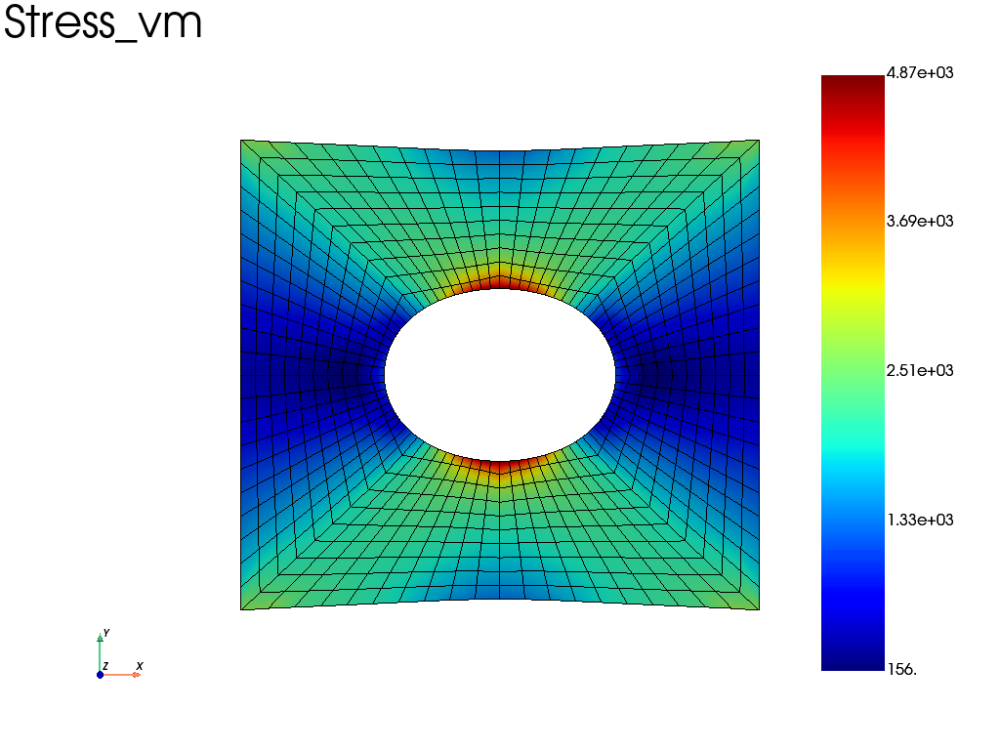

Simple examples
=================================

.. _example_plate_with_hole:

Plate with hole in tension
___________________________

.. code-block:: python

    import fedoo as fd 
    
    fd.ModelingSpace("2Dstress")
    
    #Generate a simple structured mesh "Domain" (plate with a hole).
    mesh = fd.mesh.hole_plate_mesh(nx=11, ny=11, length=100, height=100, radius=20, \
       elm_type = 'quad4', sym=False, name ="Domain") 
    
    #Define an elastic isotropic material with E = 2e5MPa et nu = 0.3 (steel)
    fd.constitutivelaw.ElasticIsotrop(2e5, 0.3, name = 'ElasticLaw') 
    
    #Create the weak formulation of the mechanical equilibrium equation
    fd.weakform.StressEquilibrium("ElasticLaw", name = "WeakForm") 
    
    #Create a global assembly
    fd.Assembly.create("WeakForm", "Domain", name="Assembly", MeshChange = True) 
    
    #Define a new static problem
    pb = fd.problem.Linear("Assembly")

    #Definition of the set of nodes for boundary conditions
    left = mesh.find_nodes('X',mesh.bounding_box.xmin)
    right = mesh.find_nodes('X',mesh.bounding_box.xmax)
    
    #Boundary conditions
    pb.bc.add('Dirichlet', left, 'Disp',    0 ) 
    #symetry condition on bottom edge (ux = 0)
    pb.bc.add('Dirichlet', right, 'DispY',  0 ) 
    #displacement on right (ux=0.1mm)
    pb.bc.add('Dirichlet', right, 'DispX', 1 ) 
    
    pb.apply_boundary_conditions()
    
    #Solve problem
    pb.solve()
    
    #extract the results from the Assembly object
    results = pb.get_results("Assembly", ["Stress", "Disp", "Strain"])
    
    #Plot the von-mises stress (averaged at nodes) on a deformed mesh with a scale factor = 10
    results.plot("Stress", "Node", component="vm", scale=10) 

